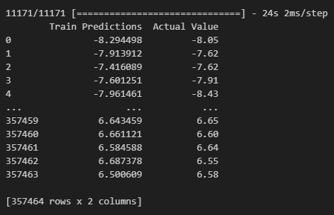

# Time Series Forecasting: Temperature Prediction using LSTM


## Overview

This project demonstrates the use of a Long Short-Term Memory (LSTM) neural network to forecast future temperatures based on historical time series data. The model is built with TensorFlow and Keras and trained on the well-known Jena Climate dataset. It showcases a complete workflow from data preprocessing and feature engineering to model training and evaluation for a time series problem.

## Dataset

The project utilizes the **Jena Climate dataset**, a benchmark for time series forecasting.
- **Source:** Recorded at the Weather Station of the Max Planck Institute for Biogeochemistry in Jena, Germany.
- **Content:** Contains 14 different features (temperature, pressure, humidity, etc.).
- **Frequency:** Data points were recorded every 10 minutes from 2009 to 2016.
- **Focus:** For this implementation, a **univariate** approach was taken, using only the historical temperature (`T (degC)`) to predict the future temperature.

## Methodology

The notebook follows a structured approach to building the forecasting model:

1.  **Data Loading and Exploration:**
    - The dataset is loaded using Pandas.
    - The temperature data is visualized over time using Matplotlib to observe trends and seasonality.

2.  **Data Preprocessing:**
    - The time series data is transformed into a supervised learning problem using a **sliding window** technique.
    - For each data point, the model uses the previous **5 temperature readings** (window size = 5) as input features (X) to predict the next temperature reading as the target (y).

3.  **Data Splitting:**
    - The dataset is split into training, validation, and testing sets to ensure the model is evaluated on unseen data.

4.  **Model Training:**
    - An LSTM model is built using TensorFlow's Keras API.
    - The model is compiled with the Adam optimizer and Mean Squared Error (MSE) as the loss function.
    - The `ModelCheckpoint` callback is used to save the best-performing model based on validation loss during training.

5.  **Evaluation:**
    - The model's performance is quantitatively measured using **Root Mean Squared Error (RMSE)**.
    - Predictions are plotted against actual values for a qualitative assessment of the model's accuracy.

## Model Architecture

The model is a simple but effective Sequential LSTM network:

```
Model: "sequential"
_________________________________________________________________
 Layer (type)                Output Shape              Param #   
=================================================================
 lstm (LSTM)                 (None, 64)                16896     
                                                                 
 dense (Dense)               (None, 8)                 520       
                                                                 
 dense_1 (Dense)             (None, 1)                 9         
                                                                 
=================================================================
Total params: 17,425
Trainable params: 17,425
Non-trainable params: 0
_________________________________________________________________
```

## Performance & Results

The model achieved a high level of accuracy in predicting the temperature for the next time step.

-   **Root Mean Squared Error (RMSE) on Validation Set:** **~0.164 °C**

This low RMSE value indicates that, on average, the model's predictions are very close to the actual temperature values.

The plot below shows a comparison of the model's predictions against the actual values on the test set, visually confirming its high performance.




## Technologies Used

- Python
- Jupyter Notebook
- TensorFlow & Keras
- Pandas
- NumPy
- Matplotlib

## How to Run

1.  **Clone the repository:**
    ```bash
    git clone https://github.com/your-username/your-repository-name.git
    cd your-repository-name
    ```

2.  **Install the dependencies:**
    ```bash
    pip install -r requirements.txt
    ```

3.  **Download the dataset:**
    Make sure to download the `jena_climate_2009_2016.csv` dataset and place it in the correct path as specified in the notebook.

4.  **Run the Jupyter Notebook:**
    Open and run the `predection_temperature.ipynb` notebook in a Jupyter environment.
    ```bash
    jupyter notebook predection_temperature.ipynb
    ```
